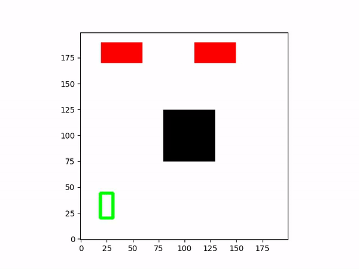
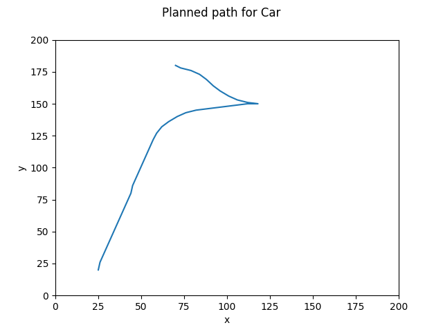
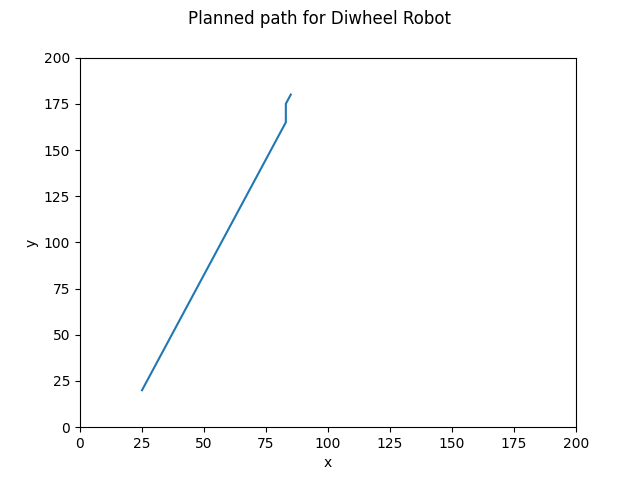
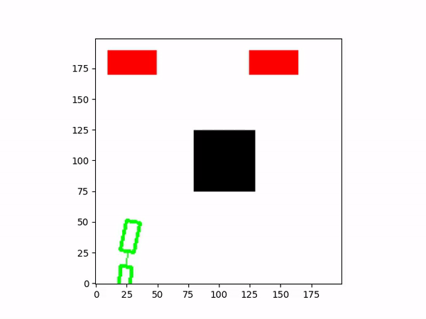
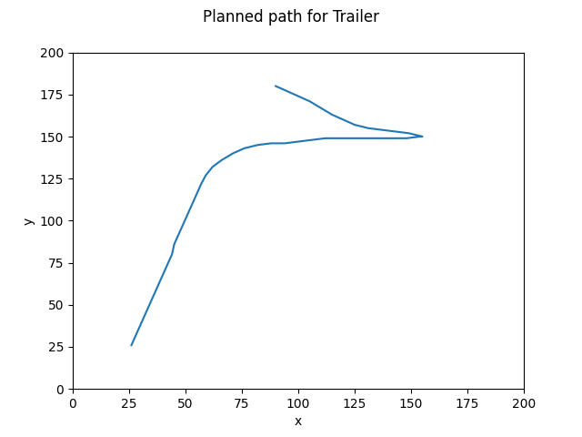

# My AutoPano

Course Homework for RBE550 - Motion Planning (Fall 2022)

Master of Science in Robotics Engineering at [Worcester Polytechnic Institute](https://www.wpi.edu/)

## Usage Guidelines

### Diwheel Robot

 Open directory Differential and run:-

```
python3 Diff-drive.py
```
Results:





### Car

 Open directory Ackerman and run:-

```
python3 Ackerman.py
```

Results:




### Truck

 Open directory Trailer and run:-

```
python3 Trailer.py
```

Results:




